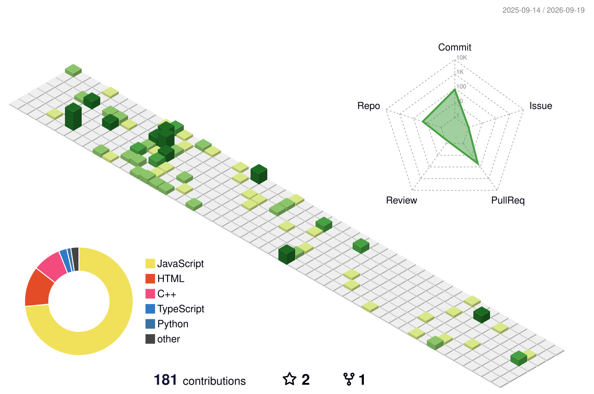

<div align="center">

```
╔══════════════════════════════════════════════════════════════════╗
║  ROHIT-TERM v2.6 ── /home/JavaTypedScript ── bash                  ║
╠══════════════════════════════════════════════════════════════════╣
║  login as: rohit                                                   ║
║  Last login: Sat Aug  1 2026 from 127.0.0.1                        ║
╚══════════════════════════════════════════════════════════════════╝
```


</div>

<br/>

<table align="center">
<tr>
<td>

```bash
guest@JavaTypedScript:~$ cat about.md
```
</td>
</tr>
</table>

<div align="center">

```
┌──────────────────────────────────────────────────────────────────┐
│  root@JavaTypedScript  │  status: online                          │
├──────────────────────────────────────────────────────────────────┤
│  > name        : Rohit R Bhat                                     │
│  > handle      : JavaTypedScript                                  │
│  > motto       : "Code when Bored"                                │
│  > repos       : 22                                                │
│  > stars_given : 13                                                │
│  > uptime      : still compiling myself...                        │
└──────────────────────────────────────────────────────────────────┘
```

</div>

<br/>

## ```> ls -la ./achievements```

<p align="center">
  
  
  
</p>

<br/>

## ```> cat stack.log```

<div align="center">


</div>

<br/>

## ```> ./run_stats.sh --3d```

<div align="center">

<!--START_3D_CONTRIB-->
<picture>
  <source media="(prefers-color-scheme: dark)" srcset="profile-3d-contrib/profile-night-rainbow.svg" />
  <source media="(prefers-color-scheme: light)" srcset="profile-3d-contrib/profile-green-animate.svg" />
  
</picture>
<!--END_3D_CONTRIB-->

<sub>▲ 3D contribution mesh, regenerated nightly by GitHub Actions ▲</sub>

</div>

<br/>

## ```> top --stats```

<div align="center">


<br/>


</div>

<br/>

## ```> git log --graph --oneline --all```

<div align="center">


</div>

<br/>

## ```> cat social.cfg```

<div align="center">

[](https://github.com/JavaTypedScript)

</div>

<br/>

<div align="center">

```
> process exited with code 0
> connection closed by remote host
> ─────────────────────────────────────
> thanks for stopping by, hit ⭐ if you liked the vibe
```


</div>
